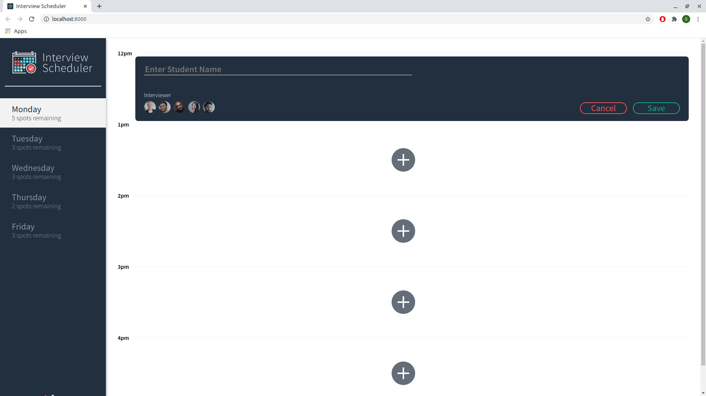
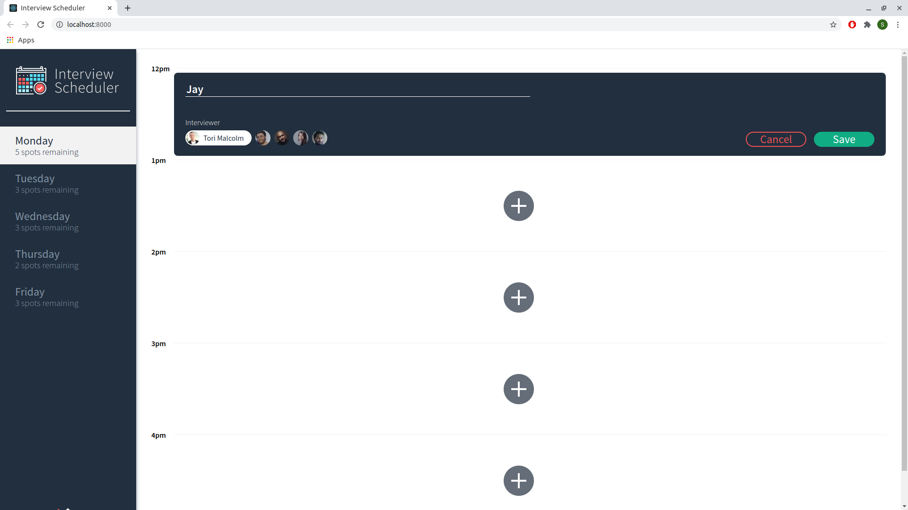

# Interview Scheduler
A React based app to practice passing on props and state to make appointments, edit appointments and delete appointments. By practicing deconstruction of arrays and objects I avoided mutating state accidentally. It will keep track of number of available interview slots, interviewers and appointments already made.

## Setup

Install dependencies with `npm install`.

## Running Webpack Development Server

```sh
npm start
```

## Running Jest Test Framework

```sh
npm test
```

## Running Storybook Visual Testbed

```sh
npm run storybook

## Screenshots





